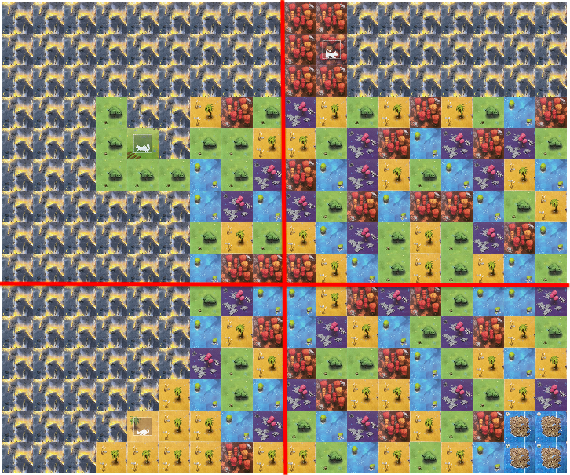
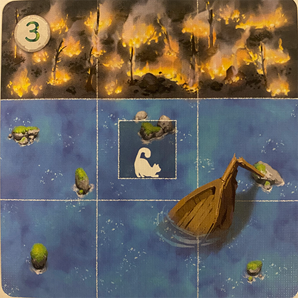
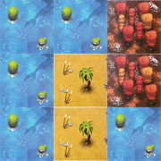
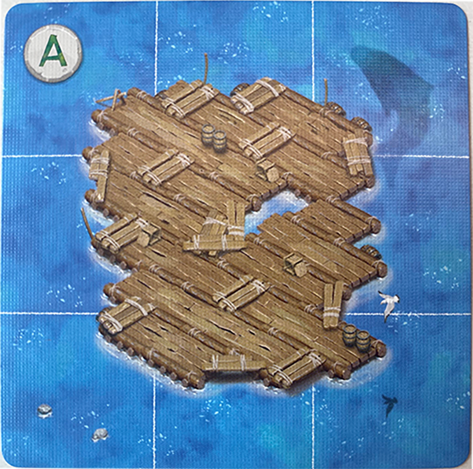

# COMP1110 Assignment 2

## Academic Honesty and Integrity

Honesty and integrity are of utmost importance.
These goals are *not* at odds with being resourceful and working collaboratively.
You should be resourceful, and you should discuss your work in this course with others taking the class.
The fundamental principle is that **you must never misrepresent the work of others as your own**.

If you have taken ideas from elsewhere or used code sourced from elsewhere, you must say so with *utmost clarity*.
At each stage of the assignment you will be asked to submit a statement of originality, either as a group or as
individuals.
This statement is the place for you to declare which ideas or code contained in your submission were sourced from
elsewhere.

Please read
ANU’s [official position on academic integrity](https://www.anu.edu.au/students/academic-skills/academic-integrity).
If you have any questions, please ask us.

When you do your assignments, carefully review the statement of originality which you must complete. Edit that statement
and update it as you complete the assignment, ensuring that when you complete the assignment, a truthful statement is
committed and pushed to your repo.

Carefully review the statements of originality in the [admin](admin) folder which you must complete at each stage. Edit
the relevant statement and update it as you complete each stage of the assignment, ensuring that when you complete each
stage, a truthful statement is committed and pushed to your repo.

## Purpose

In this assignment you will *work as a group* to master a number of major themes of this course,
including software design and implementation, group work, using development tools such as Git and IntelliJ,
and using JavaFX to build a user interface.  **Above all, this assignment will emphasize group work**;
while you will receive an individual mark for your work based on your contributions to the assignment,
**you can only succeed if all members contribute to your group's success**.

## Assignment Deliverables

The assignment is worth 35% of your total assessment, and it will be marked out of 35.
So each mark in the assignment corresponds to a mark in your final assessment for the course.
Note that for some stages of the assignment you will get a _group_ mark, and for others you will be _individually_
marked.
The mark breakdown and the due dates are described on
the [deliverables](https://comp.anu.edu.au/courses/comp1110/assessments/deliverables/) page.

Your work will be marked via your tutor accessing git, so it is essential that you carefully follow instructions for
setting up and maintaining your group repository.
At each deadline you will be marked according to whatever is pushed to your repository at the time of the deadline.
You will also be assessed on how effectively you use git as a development tool.

## Problem Description - Race to the Raft

Race to the Raft is a game in which one to four players cooperate to manoeuvre a clowder of cats off a burning island
and onto a raft. The Isle of Cats, which used to be a safe haven for felines far and wide, has fallen to the armies of
the evil Lord Vesh. Now, the island is burning, and all the cats that remain must race to the safety of the raft.

Each player will build pathways for each cat to traverse. However, time is of the essence, as the cats cannot be trapped
by the fire that is engulfing the island.

The game is won if every cat has made it safely to the raft. But, if even one cat is unable to reach the raft, or the
entire island is on fire before the cats escape, the game is over!

**Important note:** We will be building a modified, solo variant of the game. The rules we are using are slightly
different to those printed in the official game rulebook. The rules of the game outlined in this document take
precedence over the rules of the actual game. Read this page carefully and ask on the course forum if you have any
questions.

## Challenges

Race to the Raft comes with pre-defined challenges which define the layout of the island, the starting location of each
cat, and the extent to which the fire has already consumed the island.

Below is an example challenge setup:

## Playing Race to the Raft

There are three steps to each round in Race to the Raft:

1. Draw pathway cards;
2. Play or discard pathway cards to make pathways or move cats; and
3. Rest.

There is no fixed number of rounds in this game: the game continues until you win or lose.

### Step 1: Drawing Pathway Cards

The player draws six pathway cards from among the four decks. The player can draw these cards in any combination, from
any decks they wish. However, you are not allowed to look at the cards you have drawn until you have drawn all
six cards.

Decks are not replaced in this game. If a deck has no cards, you can no longer draw from that deck.
The game is lost if a player is unable to draw a card because all decks are empty.

### Step 2: Playing Pathway Cards

The player plays cards to move cats, or create paths to the island. All cards in their hand must be played before
the next step.

#### Action: Add Pathway

A player can place one pathway card from their hand onto the island. This placement must be consistent with
the [placement rules](#placing-cards-and-fire-tiles).

Afterwards, the player places a random fire tile on the island, also following the placement rules.

#### Placing Cards and Fire Tiles

- Pathway cards and fire tiles cannot have any of their squares hanging off the edge of the island.
- The squares of pathway cards and fire tiles must line up with the squares of the island.
- Pathway cards and fire tiles can be rotated in any orientation. Fire tiles can also be flipped, both horizontally and
  vertically.
- Pathway cards and fire tiles can fully or partially overlap other pathway cards.
- Pathway cards and fire tiles cannot overlap any squares with fire or any square belonging to a raft card.
- Pathway cards and fire tiles cannot overlap any squares with cats on them.
- Pathway cards and fire tiles cannot be placed under other pathway cards or fire tiles.
- Fire tiles must be placed next to existing fire. That is, at least one square of a fire tile being placed must touch
  at least one square of existing fire. Note that diagonals are not considered adjacent.
- Pathway cards do not have any adjacency requirements like fire tiles.

#### Action: Move a Cat

To move a cat:

1. Discard one card from your hand, or two cards if the cat is exhausted. Discarded cards are removed from
   the game, so we do not track the discard pile.
2. Move the cat along any number of orthogonally adjacent* squares of the same colour as
   the cat.
3. When you have finished moving the cat, the cat becomes exhausted for the rest of this round. If the cat was
   already exhausted, it remains exhausted.

Cats can move through squares occupied by other cats, but no two cats can occupy the same square.

*Given a square `s`, its orthogonally adjacent squares are the squares next to `s` and not diagonally adjacent to `s`.

### Step 3: Resting

All cards must be played from the player's hand. Once all cards have been played, any exhausted cats are no longer
exhausted and the player starts a new round, returning to Step 1.

### End of Game

#### Winning

You win if all the cats are on the raft card.

#### Losing

There are several ways that the game can be lost:

- If a player cannot place a fire tile on the island in a valid way according to the game rules;
- If there is no way for a cat to reach the raft;
- If a there are no more fire tiles remaining AND the player is required to draw one; or
- If there are no more pathway cards in any of the decks AND the player is required to draw a card.

## Component information

### Islands

The island is made up of several connected island boards, which have dimensions of either 9 x 6 or 9 x 9 squares.
The layout of the island will depend on the challenge that is being completed.
Each island can optionally have a strip of fire along one of its edges
(for the 9 x 6 island boards, this is always along the shorter edge).

Island boards are chosen randomly, and rotated randomly, so long as they match the specifications of the challenge.
These specifications are:

1. The island boards are rotated correctly to form the correctly sized board; and
2. Any strips of fire that are stipulated in the challenge are reflected in the board setup.

### Cat Location Cards

Cat Location cards, with dimensions of 3 x 3 squares, denote the starting location of each cat to be used in a given
challenge. Each location card can be identified by its numerical ID. At the start of the game, a cat must be placed on
each square with a cat icon such that the colour of the cat and the square match.

### Pathway Cards

Each pathway card has dimensions of 3 x 3 squares, and contains a mixture of red, blue, green, yellow, and purple
squares.

There are four different decks of pathway cards: the cross deck, the square deck, the circle deck, and the triangle
deck.
Each deck has a different distribution of squares.
For example, 35% of the squares in the circle deck are red, 32% are blue, 17% are yellow, 16% are green, and 0% are
purple.
If a player were looking for a pathway card with multiple red squares,
it would be a good idea to take a pathway card from the circle deck.
However, if a player were looking for a pathway card with purple squares, they would not get such a pathway card from
the circle deck.

### Fire Tiles

Fire tiles are Tetris-shaped blocks of fire, which are placed on the board throughout the duration of the game.

### Raft Cards

Observe raft card A:

Because there are no cat icons on this raft card, any cat can move onto the raft from any orthogonal direction (north,
south, east, or west).
A cat may not be moved again after it has arrived at one of the nine outer squares of the raft.

Let's compare raft card A with raft card B:

This raft card has specific colours surrounding the raft. A cat may only end on the raft on the coloured square
matching its own colour. The three squares in the bottom right corner of this card that do not have a cat image on
them are wild spaces. A cat of any colour may end on these spaces, like in raft card A above.

### Evaluation Criteria

A detailed breakdown of the marking criteria for each of the deliverables is given on
the [deliverables page](https://cs.anu.edu.au/courses/comp1110/assessments/deliverables/) of the course web site.

It is essential that you refer to
the [deliverables page](https://cs.anu.edu.au/courses/comp1110/assessments/deliverables/) to understand each of the
deadlines and what is required.
All submitted material be in your team's git repo, and in the *correct* locations, as prescribed
by the [deliverables page](https://cs.anu.edu.au/courses/comp1110/assessments/deliverables/), by each deadline. We will
only mark what is in your team's repo; anything else that you have done but not committed or pushed before the deadline
will not count.
Some parts of your assignment will be marked via tests run through git's continuous integration (CI) framework.

## String Representation

In order for us to provide unit tests for some of the tasks, and thus to give you an indication of whether you have
correctly solved them, we require a consistent representation of game state shared across all groups. This is done by
providing a String representation of the state of the game at any given point.
The String representation is **only for testing purposes**, and should not be the basis of your solution to the
assignment. We expect you to create your own object-oriented representation of the game state, write constructors for
your classes that create instances from the information in the game Strings, and to use your own objects in your
implementation of the other tasks.
An implementation that solves the (unit-testable) tasks by manipulating only the String representation will not be
eligible for full marks, even if the tasks are solved correctly.
For more guidance on this point, see the section of the FAQ below
titled ["What does 'appropriate use of object-oriented features' mean?"](#what-does-appropriate-use-of-object-oriented-programming-features-mean).

Because you will be asked to convert from these Strings into your own state representation, and from your own objects
into these Strings to return answers to unit tests, it's worth spending some time going over how they represent the
game.

## Marking FAQ and Per-Task Hints

In this section we provide answers to some frequently asked questions about the marking of the assignment, as well as
some specific guidance for some of the more open-ended tasks. This section may be updated throughout the semester in
response to questions from other students, so make sure to do an upstream pull of this assignment repo at least once per
week.

### What does "appropriate use of object-oriented programming features" mean?

This mark is provided for groups who make use of the object-orientation features we teach throughout the course.

Groups who score well on this criterion tend to be those who are not using raw Strings in their task code, but are
instead converting the provided Strings into objects in their design, and using the methods and fields contained within
those objects to complete the required tasks. High-scoring groups will only ever convert information from the game
String into another datatype in the constructor of one (or more) of the objects in their design.

Groups who score poorly on this criterion tend to be those who don't fully implement their objects (e.g they have a
class file, but it is rarely or never actually called in their `Game` or `RaceToTheRaft` classes), or those who don't
use
the information inside the objects they create to complete a given task. For example, groups who create objects, but
then still use String manipulation code to complete the relevant tasks.

Note that this mark is provided totally independently of the correctness of your solution. You could provide us the most
perfect imperative, String-manipulation-driven, object-less code we've ever seen that passes every test, and you would
still get zero on this criterion, which will cap your mark for the assignment at 75% if it's perfect in every other way.

### Why is the CI failing on the checksum stage?

This could be caused by a couple of different issues, but most likely you need to do an upstream pull. If you're still
getting checksum issues after a member of your group has done an upstream pull, and then pushed to the repo, post on Ed.

### What does "healthy use of Git" mean?

This criterion primarily relates to the frequency and informativeness of your commits. You should be committing
frequently (ideally every time you stop working on the assignment for the day/morning/evening, that's the time to
make a commit and push your work). These commits should have informative messages. For example, something like "task
4" is not an acceptable commit message, but something like "Finished implementing the displayState function
according to
the docstring" could be acceptable, and "Added visualisation of cards in displayState" would be even better.

Groups who use the same message on multiple commits that do different things will not receive full marks in this
section, nor will groups which commit large amounts of code at once. To quantify this, at a **bare minimum** there
should be at least one commit made per task completed, but really you should be committing more often than this.

### How can I try the real/original game?

As with Assignment 1, a physical copy of the game will be provided to the CSSA for storage (and usage!) in the common
room, likely some time in week 5. Please ensure if you are trying the physical copy of the game that the board is set up
exactly like the pictures if you want it to line up with the coordinates used in the test cases.

There are online demos of the game as well, but we have made significant changes to the rules, so you must use the
rules as defined here and ask on the course forum if you have any questions.

## Legal and Ethical Issues

First, as with any work you do, you must abide by the principles of
[honesty and integrity](https://comp.anu.edu.au/courses/comp1110/policies/#academic-integrity).
We expect you to demonstrate honesty and integrity in everything you do.

In addition to those ground rules, you are to follow the rules one
would normally be subject to in a commercial setting. In particular,
you may make use of the works of others under two fundamental
conditions: a) your use of their work must be clearly acknowledged,
and b) your use of their work must be legal (for example, consistent
with any copyright and licensing that applies to the given material).
**Please understand that violation of these rules is a very serious
offence**. However, as long as you abide by these rules, you are
explicitly invited to conduct research and make use of a variety of
sources. You are also given an explicit means with which to declare
your use of other sources (via originality statements you must
complete). It is important to realize that you will be assessed on the
basis of your original contributions to the project. While you won't
be penalized for correctly attributed use of others' ideas, the work
of others will not be considered as part of your
contribution. Therefore, these rules allow you to copy another
student's work entirely if: a) they gave you permission to do so, and
b) you acknowledged that you had done so. Notice, however, that if you
were to do this you would have no original contribution and so would
receive no marks for the assignment (but you would not have broken any
rules either).

