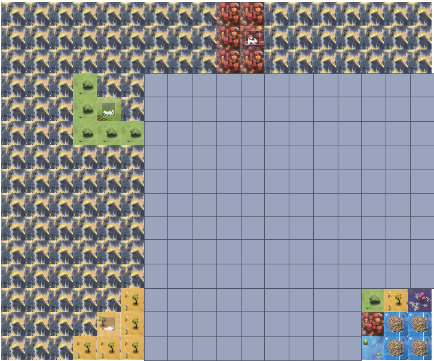

# String Representation

The *game state* is an array of strings that encompasses the state of the game.   
In order:

**[[Board](#the-board-string), [Decks](#decks), [Hand](#hand-pathway-cards), [Exhausted Cats](#exhausted-cats),
[Fire tile bag](#fire-tile-bag)]**

We will also use strings to represent [challenges](#challenge-string), [pathway card placements](#pathway-card-placement-strings), [fire tile placements](#fire-tile-placement-strings) and [cat movement](#cat-movement-string).
Each of these strings will be explained in detail below.

## The Board String

The Board string contains h lines of w characters, where h is the height of the board (in squares) and w is the width 
of the board (in squares). The board is created out of 2 or 4 Islands as described in the [Challenge String](#challenge-string) section below. 

Each square on the board is represented by a letter:
- `b` for blue squares;
- `r` for red squares;
- `y` for yellow squares;
- `p` for purple squares;
- `g` for green squares;
- `o` for raft squares ("o" for objective); and
- `w` for wildcard squares (squares on which any cat can reside).

If a cat is located on a square, the character representing that square is capitalised. For example, a green square
occupied by a green cat would be `G`.

Only the centre square of the raft card is labelled `o`. Depending on
which raft card is in play, the remaining squares on the raft card are
labelled with the colour of the cat that can reside there, or `w` representing a wild space, where any cat can end.
When a wild space is occupied by a cat, it would be represented by a capital `W`.
This loses information about the colour of that cat, but that is fine - the cat has reached the raft and cannot move again; other cats can still move through the space.
The objective space `o` cannot be occupied by a cat and as such is never represented by a capital letter.

For example:
The following string represents the board below:
Note that the newlines are a vital part of the string. Each line of text represents a row on the board.
```
"fffffffffrrfffffff
 fffffffffrRfffffff
 fffffffffrrfffffff
 fffgffyrgpygyrygbr
 fffgGfggyygprbprpg
 fffgggbgprbpygbpyb
 ffffffbpbpgrbrrbgy
 ffffffgygybpgygprb
 ffffffbrrrybgygybg
 ffffffgpbbyrprgbbp
 ffffffbyrbpybgpryg
 ffffffpgyrggrbgyby
 fffffybgbpryybpgyp
 ffffYyybpgbprygrow
 fffyyyyryygbygybww"
```


## Decks
There are four different decks that each contain 25 cards. 

Each deck is represented by a single ID character (case-sensitive) defined below:
- `A` -> CIRCLE;
- `B` -> CROSS;
- `C` -> SQUARE;
- `D` -> TRIANGLE;

Each card in a deck is represented by an ID character between `a` and `y` (case-sensitive). 

A string representing a single deck starts with the deck ID, followed by the ID of each card in the deck in 
alphabetical order.

`{deck ID}{cards left in deck}` 

For example: 
If I have the cards `a, b, c, f, g, h` in deck `B` the string representing this deck would be `Babcfgh`.

A full deck string lists all decks in alphabetical order, and all remaining cards in those decks in alphabetical 
order. If there are no cards left in a deck, the Deck ID character still appears in the string.

For example: `AabcdBCfghDafh` tells us that we have cards `a, b, c, d` in deck `A`, no cards left in deck `B`. Cards `f,
g, h`, in deck `C` and cards `a, f, h` in deck `D`. 

*Note:* Cards share ID characters, but are distinct between decks. That is, card `a` in deck `A` and card `a` in 
Deck `B`, `C` and `D` are different cards.

*Note:* The deck string only represents the cards left in the deck, not their order.
We expect you to draw randomly from the decks.

## Hand (Pathway cards)
The pathway cards in a player's hand are represented in the same way that the decks are represented, but a player can 
only 
hold up to 6 cards at once. 

For example: 
`"AfhkBCDahw"` tells us that we have cards `f`, `h`, `k` from Deck `A` and `a`, `h`, `w` from Deck `D` in hand. 

*Note:* We list only the cards that we have in hand.


### Pathway cards (utility string)
The pathway card strings are located in the `Utility` class and are separated by deck, labelled `deckA`, `deckB`, 
`deckC` and `deckD`. 
A pathway card string is 10 characters long. 
- The first character is a letter from `a` to `y` that represents the ID of the card. 
- The second to tenth characters (`b`, `g`, `p`, `r` or `y`) give the state of each square in row-major order shown in the 
  example below.

For example; from deckA, `"hbbrbyrbyb"` represents the card below:


## Exhausted Cats
Cats that have been moved this round are considered exhausted. When a cat becomes exhausted it is added to this string. 

`{colour}{row}{column}`

- **colour** is a char `B`, `G`, `P`, `R` or `Y` representing the colour of the cat. 
- **row** is two characters representing the row coordinate of the cat. e.g. `05` for row 5. 
- **column** is two characters representing the column coordinate of the cat. e.g. `12` for column 12.

For example: `"B0204G1300"` tells us that there is an exhausted Blue cat at location (2, 4), and an exhausted Green 
cat at location (13,0). 
Note: all cats appear in alphabetical order. If there are two cats of the same colour, they should be sorted first 
by row coordinate and then by column coordinate in ascending order. 

For example: if I have exhausted cats `"B0312"` and `"B0302"`, my exhausted cat string should be `"B0302B0312"`.

## Fire Tile Bag

The Fire Tile Bag string contains the ID's of the fire tiles that are left in the bag. There are 31 unique tiles 
with a character ID between `a` to `z` or `A` to `E`. Tiles are listed alphabetically and by case. 

For example: a full fire tile bag would be `"abcdefghijklmnopqrstuvwxyzABCDE"`. 

### Fire Tiles (utility string)

Each fire tile has a unique layout that is expressed by a set of coordinates relative to (0,0).

Consider placing a bounding box around each fire tile. Then, the set of coordinates that defines a fire tile are the coordinates within the bounding box that contain a fire square.

- The first character of a fire tile string is a letter from `a` to `z` or `A` to `E`, representing its ID. 
- The rest of the string is made up of 2-character substrings that represent the coordinates of the fire tile in the 
  North orientation, relative to `(0,0)`.
- The first character of a substring tells us the row-coordinate.
- The second character of a substring tells us the column-coordinate. 

For example: 
`"c000102031121"` tells us that fire tile `c` has coordinates `(0,0)`, `(0,1)`, `(0,3)`, `(1,1)` and `(2,1)`. 

Another example: 
`"i011011121321"` has coordinates `(0,1)`, `(1,0)`, `(1,1)`, `(1,2)`, `(1,3)`, `(2,1)`. Note that this tile does not 
contain coordinate `(0,0)`. 

**Note:** fire tile utility strings give us the coordinates of the tile in the North orientation relative to (0,0), and no fire tile is bigger than 9x9 tiles, so 
we don't need double-digit numbers to represent rows and columns in the string.

All the unique fire tiles are given in the [fire tile reference image](assets/labelled-fire-tiles.png). Each fire tile also has its own unique ID to identify it in a placement string.

See the [fire tile reference image](assets/labelled-fire-tiles.png) in the `assets` directory for the tile to ID 
mapping.


# Challenge String

Challenges in Race to the Raft are made up of the following substrings:

- Island 
- Fire card locations 
- Cat card locations
- Raft card location

A challenge string looks like this:
`{Island substring}F{rest of fire substring}C{rest of Cat substring}R{rest of raft substring}`

Note that the letters `F`, `C` and `R` denote the start of the `Fire`, `Cat` and `Raft` substrings respectively.

The challenge string `"LNSNLASAF000300060012001506030903C000093030341203R11215"` corresponds to the game below: Each element of this string will be explained in greater 
detail in this document. 
Note that the grey squares are sections of the board that aren't described by the challenge string because Islands 
are chosen randomly from the appropriate Large or Small boards. 



## Island (challenge substring) 

The island board layout string is either an eight- or four-character long string, made
up of two-character long substrings. Each two-character long substring defines the size of the island board to be used,
and the desired rotation of the island board if the side of the board with fire
is in play.

- The first character of each string can either be `S` or `L`. `S`,
denoting "small", denotes that a 9 x 6 island board should be used, whereas
`L`, denoting "large", denotes that a 9 x 9 island board should be used. 
- The
second character of each string is either `N`, `E`, `S`, `W`, or `A`. `N`, `E`
`S` and `W` denote the cardinal directions "north", "south", "east", and "west"
respectively. The character `A` denotes "any", and means
that the side of the island board without fire should be used. As a result, the
island board can be rotated in any direction.

*Note*: because of the layout of the game, the 9 x 6 island boards can only
ever have the rotations `N`, `S`, or `A`. If a 9 x 6 island board has rotation
`A` (that is, for the two-character string `"SA"`), then it can only be rotated
north or south.

The ordering of each two-letter string determines where each island board
should be placed. 

- The first two-character substring is the Island in the top-left corner. 
- The second two-character substring is the Island in the bottom-left corner. 
- The third two-character substring is the Island in the top-right corner
- The fourth two-character substring is the Island in the bottom-right corner. 

If this challenge has only two Islands, they are still placed in this way with the first Island placed above the 
second Island.

Here is an example board generated by the string `"LNSNLASA"`:


The red lines separate each island, and the numbers on each island correspond to
the ordering of islands within the string:
- "1" corresponds to `"LN"`;
- "2" corresponds to `"SN"`;
- "3" corresponds to `"LA"`; and
- "4" corresponds to `"SA"`.

Here is an example of the board generated by the string `"LNSN"`:


The red lines separate each island and the numbers on each island correspond to the ordering of islands in the 
string in the same way as the 4-island example.

## Fire (challenge substring)

Fire cards are 3 x 3 cards containing only fire.

The Fire substring starts with `F` and is followed by zero or more fire location substrings. 

Each location substring is defined as follows:
- The first two characters represent the row coordinate of top-left square of the fire card. For example: `04` represents row 4. 
- The second two characters represent the column coordinate of the top-left square of the fire card. For example: `14` represents column 14. 

For example: the string `"F03100409"` would tell us that there is a fire card placed at row 3, column 10 `(3,10)` and 
another at row 4, column 9 `(4,9)`.

## Cat (challenge substring)
Cat cards are 3 x 3 placement cards containing terrain, fire, and the starting
location of at least one cat. 

The cat challenge substring starts with `C` and is followed by at least one cat card placement.

Cat card placements are denoted by a five-letter string.
- The first character is number between `0` and `6` representing the ID of the cat card.
- The second and third characters represent the row coordinate of the top-left square of the cat card.
- The fourth and fifth characters represent the column coordinate of the top-left square of the cat card.

For example: the string `"C00211` tells us that Cat card `0` is placed at row 2, column 11, `(2,11)`.

### Cat (utility string)
The `CAT_CARDS` array in the `Utility` class stores information about each cat card in the game. 
- The first character tells us the ID of the cat card and is a number between `0` and `6`.
- The second to tenth characters (`b`, `g`, `p`, `r`, `y`, `B`, `G`, `P`, `R`, `Y`, or `f`) give the state of each square in row-major order shown in the
  example below.

For example: `3gffgGfggg` represents the cat card pictured below which has been numbered to show the index
within the string that each letter is located:


## Raft (challenge substring)
Raft cards are 3 x 3 placement cards containing a raft. The raft substring is a six-character substring describing 
the location and ID of a raft card.
- The first character of the string is `R`, stating that
it is a raft card. 
- The second character is a number between `0` and `3` representing the ID of the raft card.  
- The third and fourth characters represent the row coordinate of the top-left corner of the raft card.
- The fifth and sixth characters represent the column coordinate of the top-left corner of the raft card.

For example: `"R11215"` represents Raft card 1 (pictured below) at location (12,15).


### Raft (utility string)
The String located in the `Utility` class tells us the state of each individual square on a raft card. 
The string is 10 characters long and represents the following: 
- The first character tells us the ID of the Raft card (`0` to `3`).
- The second to tenth characters (`b`, `g`, `p`, `r` or `y`) give the state of each square in row-major order shown in the
  example below.

For example: the string `"1gyprowbww"` represents the following raft tile which has been numbered to show the index 
within the string that each letter is located.


# Action string
An action string is one of three different types of strings representing one of the three different actions in the 
game: pathway card placement, 
fire tile placement 
or cat movement. 

### Pathway Card Placement String
Pathway card placement strings are defined as follows:

`{Deck}{ID}{row}{column}{orientation}`
- The first character is a letter from `A` to `D` that represents the Deck this card is from.
- The second character is a letter from `a` to `y` that represents the ID of the card.
- The fourth and fifth characters represent the row-coordinate where the top-left square of this card should be placed.
- The sixth and seventh characters represent the column-coordinate where the top-left square of this card should be placed.
- The eighth character is a letter `N`, `E`, `S`, or `W` representing the orientation in which this card should be 
  placed. 

For example: `"Ab1208S` tells us that card `b` from deck `A` should be placed at `(12,8)` in the `SOUTH` orientation.
The position of the top-left square already takes into account the card's orientation, that is, given the same coordinates,
a card always covers the same squares on the island, regardless of its orientation.

### Fire Tile Placement String

Fire tile placement strings are defined as follows:

`{ID}{row}{column}{flipped}{orientation}`

- The first character is a letter `a` to `z` or `A` to `E`, case sensitive that represents the ID of this fire tile.
- The second and third characters represent the row-coordinate of the top-left square of the bounding box of the fire tile when placed
- The fourth and fifth characters represent the column-coordinate of the top-left square of the bounding box of the fire tile when placed
- The sixth character is a letter `T` for true or `F` for false, representing whether a tile has been flipped 
  across the vertical axis.
- The seventh character is a letter `N`, `E`, `S` or `W` representing the orientation of this tile.

Note: When we flip a tile, we take the tile in the north orientation, flip it across the vertical axis and then 
apply any rotation. 

For example: 

`"l0003TW"` tells us that the tile `l` is placed at `(0,3)` in the `West` orientation and has been flipped. Whilst 
`"l0003FW"` tells us that the tile `l` hasn't been flipped, and is in the `West` orientation. 

Below is an example of the tile `l` in all un-flipped `F` orientations, and all flipped `T` orientations.
As for all other placements, the position of the top-left square takes into account the tile's orientation and flip-status.
That is, regardless of how the tile has been rotated or flipped, the resulting bounding box's top-left corner always matches
the given coordinates.


### Cat movement string
Cat movement strings are 11 or 13-character strings defined as follows: 

`{colour}{startLocation}{endLocation}{discardedCards}`

- The first character represents the colour of the cat `B`, `G`, `P`, `R` or `Y`.
- The second and third characters represent the starting row-coordinate of the cat. 
- The fourth and fifth characters represent the starting column-coordinate of the cat. 
- The sixth and seventh characters represent the ending row-coordinate of the cat.
- The eighth and ninth characters represent the ending column-coordinate of the cat.
- The thenth character represents the deck ('A' to 'D') of the card discarded to move the cat
- The eleventh character represents the ID ('a' to 'y') of the card discarded to move the cat
- The twelth character (if present) represents the deck ('A' to 'D') of the extra card discarded to move an exhausted cat
- The thirteenth character (if present) represents the ID ('a' to 'y') of the extra card discarded to move an exhausted cat 

For example: 
`"R01040410Ac"` tells us that the Red (non-exhausted) cat at location `(1,4)`, should be moved to Location `(4,10)`, and that card 'c' of deck 'A' was discarded for that action.

## Draw Request
We also use a string to encode how cards should be drawn for a player's hand. 

The string is made up of 2-character substrings that determine the deck to draw from, and how many cards to draw 
from that deck. 

- The first character tells us the deck to draw from: `A`, `B`, `C`, or `D`. 
- The second character tells us how many cards to draw from that deck: `1` tp `6`.

The total number of cards drawn must always be 6, but these can come from any decks. 

For example: 

`"A3B1D2"` tells us we should draw 3 cards from deck A, 1 card from deck B, and 2 cards from deck D. No cards are 
being drawn from deck C, so we do not include that letter in the string.
